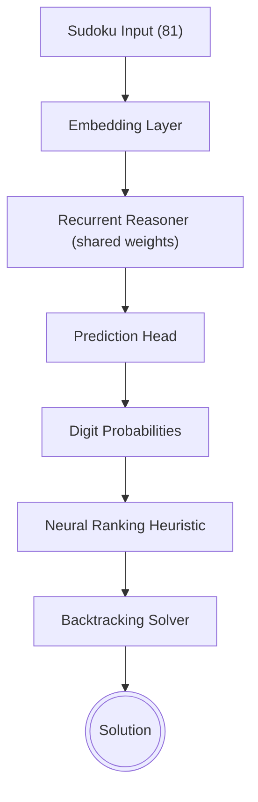

# 🧠 Neuro-Symbolic Sudoku Solver (RRM + Neural + LLM Hybrid)

## A neuro-symbolic Sudoku solving system that combines:

Recurrent Neural Reasoning Model (RRM-style)
Classical backtracking solver
Neural-guided search optimization
Optional LLM-assisted reasoning via OpenRouter

This project demonstrates how learned heuristics can significantly improve symbolic search efficiency without sacrificing correctness.

# 🚀 Key Idea

Instead of replacing classical solvers, we guide them using neural predictions.

## Pipeline:
Sudoku Puzzle
     ↓
Neural Recurrent Model (RRM-style)
     ↓
Probability per cell (1–9)
     ↓
Digit ranking heuristic
     ↓
Symbolic Backtracking Solver
     ↓
Optimized solution search

Optional extension:

Neural Model → Uncertainty → OpenRouter LLM → Better ranking fallback

# 📌 Features
## 🧠 Neural Component
Recurrent reasoning architecture (shared-weight iterative block)
Multi-head attention + feedforward network
Deep supervision across reasoning steps
Cell-wise digit probability prediction
## 🧩 Symbolic Component
Classic Sudoku backtracking solver
Constraint validation (row, column, 3×3 box)
Node and backtrack counting
Baseline performance measurement
## ⚡ Neuro-Symbolic Integration
Neural-guided digit ordering
MRV-style heuristic improvement
Search space reduction
Significant reduction in explored nodes
## 🌐 LLM Extension (OpenRouter)
Uses LLM only when neural model is uncertain
Generates ranked digit suggestions
Acts as fallback reasoning system
Improves robustness on hard states
## 📊 Results (Typical)

| Method | Nodes Explored | Backtracks | Speed |
| :--- | :--- | :--- | :--- |
| **Baseline Solver** | High | High | Slow |
| **Neural Guided** | Reduced (2–20×) | Lower | Faster |
| **Hybrid (LLM + NN)** | Best stability | Lowest | Best |

# 🏗️ Architecture

# 🧪 OpenRouter Integration (Optional)

**When the model is uncertain:**

Sudoku state is sent to LLM
LLM returns ranked digit suggestions
Used as fallback ordering heuristic

This creates a 3-layer reasoning system:

Neural Model → Fast heuristic
LLM → High-level reasoning fallback
Symbolic Solver → Guaranteed correctness
